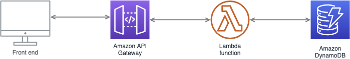
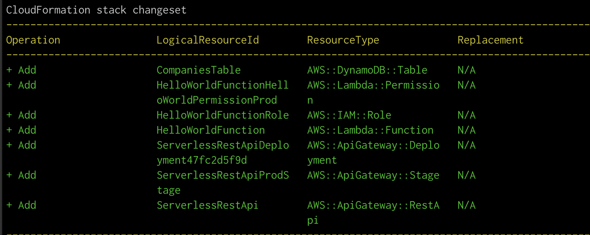
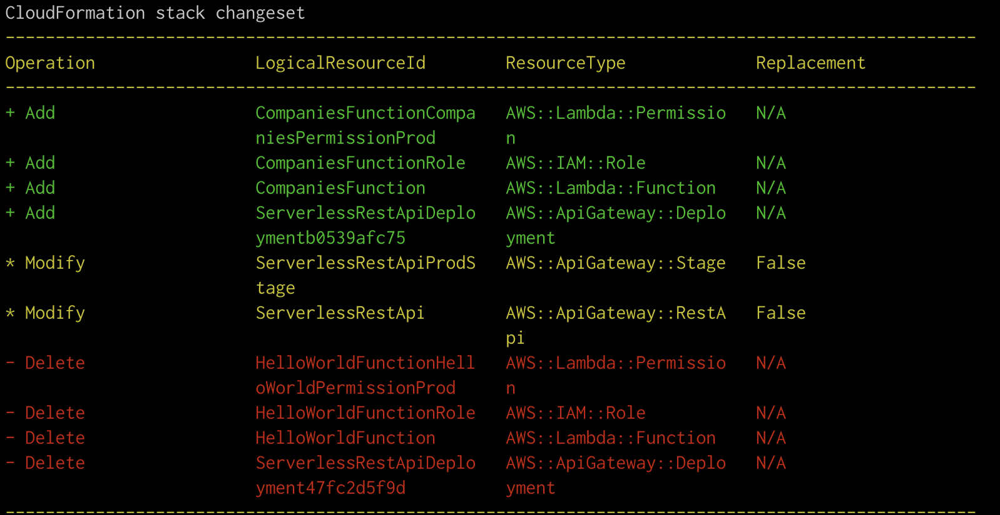
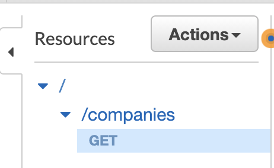
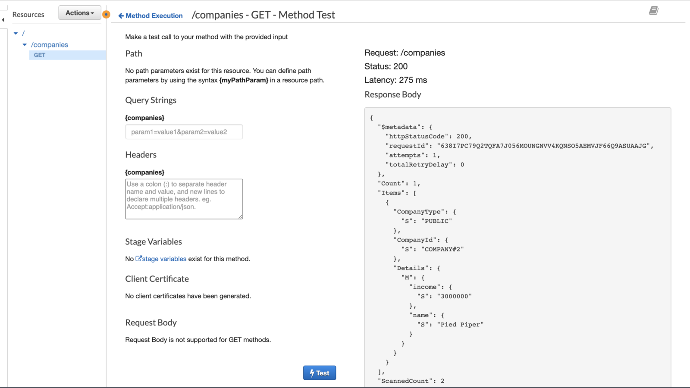

# Is your web app secure enough?

** The views in this post are my own and do NOT represent or reflect the views of my employer or any organisations **
In this post we will build an insecure web application. The goal is to share some of my learnings building AWS serverless apps. At the same time, I am hoping this would start a discussion that increases the awareness around security when architecting or developing software.
This came to mind as I went through the “Secure development training” programme at https://academy.safestack.io/ lately, so thought that could be an opportunity to introduce a couple of security vulnerabilities as part of the app, leaving it to the reader to identify them and suggest fixes. Hopefully this would be a fun exercise.
Below is the stack used:
CloudFormation
AWS lambda
AWS API Gateway
DynamoDB
React JS
Node JS

Before we start, here is a quick view about the programme:
Other than the awesome “Security Fundamentals” course, which covers vulnerability & risk, threat actors & motivations, and explains why security matters, there is the more technical “Finding and Fixing Web Application Security Vulnerabilities” course that has some pretty cool explanations and labs on how to secure web apps. As my words can’t do justice to this programme, I would encourage you to give it a try. Oh, and there’s also a new “Threat assessment” course that got added lately. Overall, I highly recommend these courses for all development teams.

### What are we building?

The app we're building will retrieve a list of companies from a dynamo db and display them on the UI; selecting a company will show its revenue. Note that only companies flagged with "public" in the DB will be displayed on the UI. No details about private companies will be visible.

Please check this [link](https://companies-data-demo.s3.amazonaws.com/index.html) if you'd like to take a gander at the demo web application before reading the step - Please ignore the styling as it's not part of this post.

Let us begin with the implementation step by step. The architecture of our app is pretty simple and looks like this: 


## Create DynamoDB

First, we will setup the dynamo database table using CloudFormation (check [my previous article](https://ali-haydar.medium.com/setup-a-web-server-on-aws-using-cloud-formation-b84fcee25e70) about getting started with CloudFormation).

Below is a summary about DynamoDB to get us started:

> DynamoDB is a schemaless database that has the following components: table, items and attributes. A table is a collection of items, and each item is a collection of attributes.

> Each item has a unique primary key, which distinguishes each item from the others.

> The primary key can either be simple or composite - When the primary key is simple it will be formed of a single key called partition key . In the composite case, the primary key will be formed of 2 attributes partition key & sort key .

> A partition key value is used as an input to an internal hash function in dynamo; this function outputs the actual partition that is the physical storage in which the item will be stored. If the primary key was simple, the partition key must be unique. If the primary key was composite, then multiple items can have the same partition key; these items are stored together in sorted order by the sort key value.

> We can have as many attributes as we want in an item. An attribute is a data element that's doesn't need to be broken any further

In our use case, we need to access the DB to get the list of companies that are public (this is a scan of the DynamoDB table). We also need to get the attributes of a given public company(this is a query by company id). A possible way to design the table is to have a partition_key that would contain the company id (e.g.company#id) , a sort_key that would contain whether the company is private or public. This enable us to scan the table then filter it by the sort key (private/public), and at the same time enable us to query for a single company by the partition key (CompanyId).

This is the CloudFormation template to build the DynamoDB:

```
Resources:
  CompaniesTable:
    Type: AWS::DynamoDB::Table
    Properties:
      TableName: companies
      AttributeDefinitions:
        - AttributeName: CompanyId
          AttributeType: S
        - AttributeName: CompanyType
          AttributeType: S
      KeySchema:
        - AttributeName: CompanyId
          KeyType: HASH
        - AttributeName: CompanyType
          KeyType: RANGE
      ProvisionedThroughput:
        ReadCapacityUnits: 5
        WriteCapacityUnits: 5
      Tags:
        - Key: author
          Value: ali
```

Upload the template to CloudFormation using AWS console, create the stack and verify the DynamoDB got created successfully.
Create a few items in the companies table - Feel free to create these manually using the AWS console or through the AWS CLI.

```
aws dynamodb put-item \
 --table-name companies \
 --item '{
  "CompanyId": { "S": "COMPANY#1" },
  "CompanyType": { "S": "PRIVATE" },
  "Details": { "M": {
    "name": { "S": "Dunder Mifflin" },
    "revenue": { "S": "1000000" }
    } }
  }' \
 --return-consumed-capacity TOTAL \
 --return-item-collection-metrics SIZE
```

In this command, we're putting a new item that represents a company that has a name and a revenue. Create a few items, changing the CompanyId, Type and details in every request. The M, and S letters in the command represent the type of the field we're adding. The full list of data types can be found [here](https://docs.aws.amazon.com/amazondynamodb/latest/APIReference/API_AttributeValue.html).

## AWS SAM - Lambda & Api endpoint creation

We will start this section by setting up AWS SAM, which is an open-source framework that you can use to build serverless applications. It will provide us with the necessary resources such as API and Lambda (Sam will help us generate boilerplate code, from which we can start the development of our app)

- Start by [installing SAM client](https://docs.aws.amazon.com/serverless-application-model/latest/developerguide/serverless-sam-cli-install.html)
- Download a sample SAM application: sam init
- Answer the questions as they appear; I selected the following:

  ```
  Which template source would you like to use?
   1 - AWS Quick Start Templates
  What package type would you like to use?
   1 - Zip (artifact is a zip uploaded to S3)
  Which runtime would you like to use?
   1 - nodejs12.x
  AWS quick start application templates:
   1 - Hello World Example
  ```

The sam init command creates a directory with the name that you provided as the project name. Full details can be found at: https://docs.aws.amazon.com/serverless-application-model/latest/developerguide/serverless-getting-started-hello-world.html

Copy/paste the dynamoDB resource we created earlier into the new template.yaml that got generated, under the Resources section. This will include the companies table in the new stack that we're creating; it makes sense to delete the old stack in this case. In AWS console, navigate to Cloud Formation, select the earlier created stack and delete it.

Note in the yaml file that this template outputs the arn of the api gateway endpoint, the function and the lambda role.

- Run `sam build`
- Run `sam deploy --guided` (This requires that you have your [AWS credentials set properly](https://docs.aws.amazon.com/cli/latest/userguide/cli-chap-configure.html))

* Follow the on-screen prompts:

  ```
  Stack Name [sam-app]: companies-data-demo
   AWS Region [us-east-1]:
   #Shows you resources changes to be deployed and require a 'Y' to initiate deploy
   Confirm changes before deploy [y/N]: y
   #SAM needs permission to be able to create roles to connect to the resources in your template
   Allow SAM CLI IAM role creation [Y/n]: Y
   HelloWorldFunction may not have authorization defined, Is this okay? [y/N]: y
   Save arguments to configuration file [Y/n]: Y
   SAM configuration file [samconfig.toml]:
   SAM configuration environment [default]:
  ```

A new stack will now be created with the following resources:


Navigate to the AWS console, notice that a new lambda and API gateway endpoint got created. Now, it's time to update these to reflect what we want.

### API & Lambda infrastructure

First, we will start by fixing the name of the lambda and deleting anything related to hello world.
Change the HelloWorldLambda under Resources to:

```
CompaniesFunction:
    Type: AWS::Serverless::Function
    Properties:
      FunctionName: companies-data-demo
      CodeUri: src/
      Handler: app.lambdaHandler
      Runtime: nodejs12.x
      Role: !GetAtt CompaniesFunctionRole.Arn
      Events:
        Companies:
          Type: Api
          Properties:
            Path: /companies
            Method: GET
```

Delete the Outputs section, as we do not need the stack outputs in our example.

Run `sam build` and `sam deploy` again to build & deploy the updated stack. The changeset will look like this:


To validate this in the AWS console:

- Navigate to API Gateway, and you should see and api called companies-data-demo, with an endpoint /companies/Get: 

* Navigate to Lambda, and select the newly created lambda to see how it's connected to the API gateway
* Navigate to dynamoDB and validate that the "companies" table got created. Note that it has no data at the moment. Feel free to use the command listed in the section above to load some data

You might be wondering how is the API being created even though our CloudFormation template does not include it. According to the AWS documentation:

> An AWS::Serverless::Api resource need not be explicitly added to a AWS Serverless Application Definition template. A resource of this type is implicitly created from the union of Api events defined on AWS::Serverless::Function resources defined in the template that do not refer to an AWS::Serverless::Api resource.

But in our case, we would need to explicitly define it, as we want to access this API from the browser, and we'd want to enable Cors. The template will be as follows (it includes the roles and policies creation as well):

```
AWSTemplateFormatVersion: '2010-09-09'
Transform: AWS::Serverless-2016-10-31
Description: >
  companies-data-demo

  Sample SAM Template for companies-data-demo

# More info about Globals: https://github.com/awslabs/serverless-application-model/blob/master/docs/globals.rst
Globals:
  Function:
    Timeout: 3

Resources:
  CompaniesTable:
    Type: AWS::DynamoDB::Table
    Properties:
      TableName: companies
      AttributeDefinitions:
        - AttributeName: CompanyId
          AttributeType: S
        - AttributeName: CompanyType
          AttributeType: S
      KeySchema:
        - AttributeName: CompanyId
          KeyType: HASH
        - AttributeName: CompanyType
          KeyType: RANGE
      ProvisionedThroughput:
        ReadCapacityUnits: 5
        WriteCapacityUnits: 5
      Tags:
        - Key: author
          Value: ali

  CompaniesTableReadOnlyAccessPolicy:
    Type: AWS::IAM::ManagedPolicy
    Properties:
      Description: Policy for Read only companies table
      ManagedPolicyName: companies-readonly-access
      Path: /
      PolicyDocument:
        Version: 2012-10-17
        Statement:
          - Sid: CompaniesReadOnlyAccess
            Effect: Allow
            Action:
              - 'dynamodb:Scan'
              - 'dynamodb:GetItem'
              - 'dynamodb:Query'
            Resource:
              - !GetAtt CompaniesTable.Arn

  CompaniesFunctionRole:
    Type: AWS::IAM::Role
    Properties:
      Description: Role to allow the lambda to access the companies table
      AssumeRolePolicyDocument:
        Version: 2012-10-17
        Statement:
          - Effect: Allow
            Principal:
              Service:
                - lambda.amazonaws.com
            Action:
              - 'sts:AssumeRole'
      RoleName: companies-function-role
      ManagedPolicyArns:
        - arn:aws:iam::aws:policy/AWSLambdaExecute
        - !Ref CompaniesTableReadOnlyAccessPolicy

  CompaniesApi:
    Type: AWS::Serverless::Api
    Properties:
      Cors:
        AllowMethods: "'GET,OPTIONS'"
        AllowHeaders: "'content-type'"
        AllowOrigin: "'*'"
      StageName: Prod

  CompaniesFunction:
    Type: AWS::Serverless::Function
    Properties:
      FunctionName: companies-data-demo
      CodeUri: src/
      Handler: app.lambdaHandler
      Runtime: nodejs12.x
      Role: !GetAtt CompaniesFunctionRole.Arn
      Events:
        Companies:
          Type: Api
          Properties:
            Path: /companies
            Method: GET
            RestApiId: !Ref CompaniesApi

```

### Lambda code

Now that our endpoint is created, we can start with updating the logic of our lambda function.

The lambda function is going to get the items from the "Companies" table where the type of the company is "PUBLIC".

- Under the src folder tidy up the package.json file by uninstalling axios, mocha and chai: `npm uninstall axios mocha chai`
- In the app.js file, remove the data that's related to hello-world created by the sam init command
- In your terminal install the client sdk that enables the interaction with dynamo db `npm i @aws-sdk/client-dynamodb @aws-sdk/util-dynamodb`
- Change the implementation in app.js to the following:
  ```const { DynamoDB } = require('@aws-sdk/client-dynamodb');
  exports.lambdaHandler = async (event, context) => {
  const dynamodb = new DynamoDB({ region: 'us-east-1' });
  const results = await dynamodb.scan({ TableName: 'companies' });
  console.log('the result return is: ', JSON.stringify(results));
  };
  ```
  in this previous snippet we're just scanning the query db and listing the results.

* Now, it's time to deploy the lambda and make sure it's working properly. Run the following command: `sam build && sam deploy - capabilities CAPABILITY_NAMED_IAM`

This can be tested through multiple methods, one of them is by going to the AWS console → Lambda; select the newly created lambda → Click the 'Select test events' dropdown, and create a new event (keep the default values as we're not relying on the event yet) → Click the test button. Once done, navigate to the CloudWatch log associated with this lambda, and verify that the companies inserted into your 'companies' table are printed in the logs.

**Build the functionality**

In this subsection, we will build the functionality we need, it has a defect (or multiple defects), but that's the goal - later on this is where we would be finding the security issue.
Update the app.js to be as follows (check the inline comments):

```
const { DynamoDB } = require('@aws-sdk/client-dynamodb');
const { unmarshall } = require('@aws-sdk/util-dynamodb');

exports.lambdaHandler = async (event, context) => {
  try {
    console.log('here is the event received', event);
    const dynamodb = new DynamoDB({ region: 'us-east-1' });
    const params = {
      TableName: 'companies',
    };

    if (!event.queryStringParameters) {
      params.ExpressionAttributeValues = {
        ':companyType': {
          S: 'PUBLIC',
        },
      };
      params.FilterExpression = 'CompanyType = :companyType';
    } else {
      params.ExpressionAttributeValues = {
        ':companyId': {
          S: `COMPANY#${event.queryStringParameters.companyId}`,
        },
      };
      params.FilterExpression = 'CompanyId = :companyId';
    }

    const results = await dynamodb.scan(params);
    console.log('results', results);
    let unmarshalledResults = [];
    for (const item of results.Items) {
      const unmarshalledRecord = unmarshall(item);
      unmarshalledResults.push(unmarshalledRecord);
    }

    console.log('unmarshalled results', unmarshalledResults);
    return {
      statusCode: 200,
      headers: {
        'Content-Type': 'application/json',
        'Access-Control-Allow-Origin': '*',
      },
      body: JSON.stringify(unmarshalledResults),
    };
  } catch (e) {
    console.error('something went wrong', e);
    return {
      statusCode: 500,
      body: 'Something has gone wrong, please contact the support team',
    };
  }
};
```

Deploy the code again.

We now have a running backend. After you've got it deployed, and created a few items in the dynamodb table, navigate to the API Gateway in AWS console and test the newly created endpoint: 

## Front End

Now that we have everything ready on the backend, we will build a simple React application that consumes the API we created.

Run the following command: `npx create-react-app front-end`

We would want to change the code in the App.js component to do an http call to the endpoint. In AWS Console, navigate to API Gateway → Stage, select Prod - Notice an "Invoke url https://nfyhswe7rg.execute-api.us-east-1.amazonaws.com/Prod/companies" at the top of the page. Click that link and you should have the same data you added in DynamoDB returned in your browser.

Our front end will have 2 components, App.js that contains the list of public companies, and CompanyDetails, which shows each company's details.

App.js will look like this:

```
import React, { useState } from 'react';

const CompanyDetails = ({ companyId, companyName }) => {
  const url =
    'https://nfc079xjo3.execute-api.us-east-1.amazonaws.com/Prod/companies';

  const [returnedRevenue, setReturnedRevenue] = useState([]);

  const handleClick = () => {
    fetch(`${url}/?companyId=${companyId.split('#')[1]}`)
      .then((response) => response.json())
      .then((data) => {
        setReturnedRevenue(data);
      });
  };

  return (
    <li>
      {companyName} <button onClick={handleClick}>Show revenue</button>
      <div>
        {returnedRevenue.length ? returnedRevenue[0].Details.revenue : ''}
      </div>
    </li>
  );
};

export default CompanyDetails;
```

CompanyDetails.js will look like this:

```
import React, { useState } from 'react';

const CompanyDetails = ({ companyId, companyName }) => {
  const url =
    'https://nfc079xjo3.execute-api.us-east-1.amazonaws.com/Prod/companies';

  const [returnedRevenue, setReturnedRevenue] = useState([]);

  const handleClick = () => {
    fetch(`${url}/?companyId=${companyId.split('#')[1]}`)
      .then((response) => response.json())
      .then((data) => {
        setReturnedRevenue(data);
      });
  };

  return (
    <li>
      {companyName} <button onClick={handleClick}>Show revenue</button>
      <div>
        {returnedRevenue.length ? returnedRevenue[0].Details.revenue : ''}
      </div>
    </li>
  );
};

export default CompanyDetails;
```

Start your front end by running `npm start`, a new page will open in your browser at http://localhost:3000.

Notice the following:

- When we load the page, we send a request that would retrieve all the public companies
- When we click the "Show revenue" button, we send another request that returns the revenue of the company given the ID passed (of course this can be avoided by directly showing the value which we already have on the front-end, but this defeats the purpose of the blog post)

Please excuse the UI and the style as I did not spend much time or effort on this part.

What are the security vulnerabilities? or any other vulnerabilities? How can we solve them?

The full source code can be found at: https://github.com/AHaydar/companies-data-demo

Thanks for reading.
